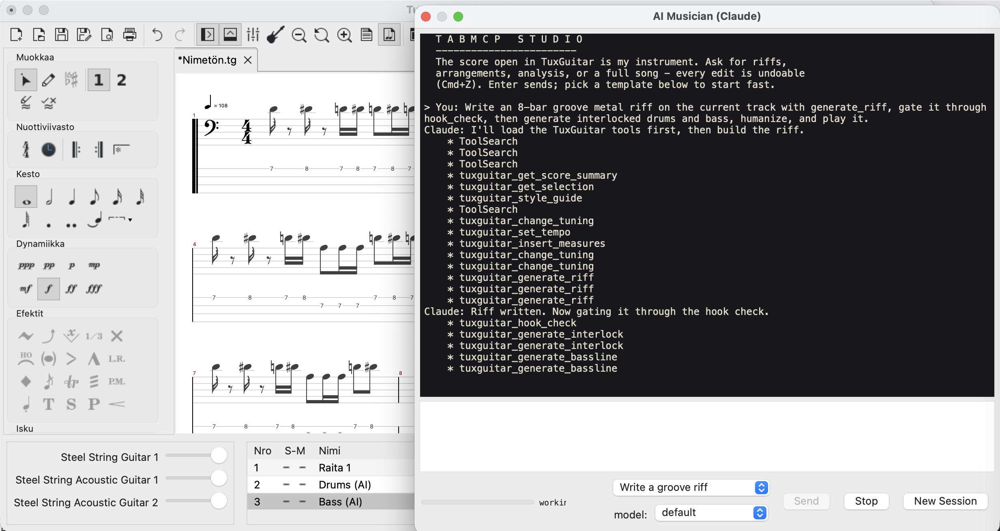

# TabMCP — an AI musician inside TuxGuitar

TabMCP connects MCP-compatible AI clients (Claude Code, OpenAI Codex,
Google Antigravity/Gemini, xAI Grok, Claude Desktop, ...)
to the score currently open in [TuxGuitar](https://tuxguitar.app). The AI can
**compose, arrange, listen to its own output, critique it, and revise** —
like a musician in the studio, not a one-shot generator.


*The embedded chat writing a groove metal arrangement live inside TuxGuitar: quick-action templates, model picker, and the composition pipeline (generate_riff, hook_check, interlocked drums, bass) streaming in the studio transcript.*

- **Rust service** (`crates/`): the MCP server, normalized score model,
  music-theory engine (scales, chords, fingering, generation, critique),
  and the audio "ear" (render + DSP analysis).
- **Java plugin** (`tuxguitar-mcp-bridge/`): a thin bridge inside TuxGuitar
  exposing the live score over a localhost socket and applying edits through
  TuxGuitar's own action/undo system.

Docs: [PLAN.md](PLAN.md) (architecture) ·
[docs/PROTOCOL.md](docs/PROTOCOL.md) (bridge protocol) ·
[docs/ROADMAP.md](docs/ROADMAP.md) (what's next).

## The AI Ear refinement loop

The heart of the project: instead of assuming generated music sounds good,
the AI iterates —

1. **Compose** a riff / arrangement (or read what the user wrote)
2. **Evaluate** — `tuxguitar_evaluate` scores every track: groove
   consistency, syncopation, motif development (literal vs varied repeats),
   per-measure tension curve, harmonic rhythm, rest share, robotic-dynamics
   and boredom detection, cross-track clashes, key/scale, a human-feel
   check for AI artifacts, and the pass-over-pass trend
3. **Listen** — `tuxguitar_render_and_listen` renders the real mix through
   TuxGuitar's own soundfont (headless MIDI -> fluidsynth -> WAV -> DSP:
   loudness, clipping, spectral balance, quiet holes);
   `tuxguitar_listen_stems` renders **each track in isolation** to hear
   which instrument causes a problem
4. **Fix** the top issue with the edit tools — every edit previews first,
   is revision-checked, and lands in TuxGuitar's undo stack
5. **Repeat**, narrating each pass — the undo stack is the version history
   (one Cmd+Z per pass)

Around the loop sit the composition instruments: **Riff DNA** (extract a
riff's identity and evolve it instead of copying), **riff evolution**
(hill-climb a riff through mutation generations scored by the AI Ear),
**theme tracking** (musical memory across sections: restated, varied,
inverted, fragmented motifs; call-and-response detection), the **hook
check** (a critic whose only job is to reject forgettable riffs), the
**realism check** (impossible stretches, string-breaking bends), the
**difficulty analyzer** (1-10 with reasons, fatigue and picking
simulation), **producer notes** (arrangement-level suggestions), **style
matching** ("what makes this sound like death metal?"), genre **blends**
("60% death metal, 40% doom"), and **emotion targets** ("calm, uneasy,
aggressive, victorious" checked against the measured tension curve).

## Tool surface (58 tools + 3 prompts)

| Area | Tools |
|---|---|
| Status & reading | `get_bridge_status`, `get_score_summary`, `get_measures`, `get_selection` |
| AI Ear | `evaluate` (full scorecard; optional `style` targets, `tension_target` arcs, `emotion_target` journeys), `render_and_listen` (full mix + per-measure levels), `listen_stems` (per track, with auto-prescriptions) |
| Arrangement | `generate_transitions` (drum fills, buildups, band stops at section boundaries - before every marker at once if asked), `ornament` (style-idiomatic articulation pass: vibrato, slides, pinch squeals, grace notes, tremolo conversion), `plan_harmony` (mood or degree progressions with voice-leading verdicts and pedal warnings), `apply_harmony` (write the plan as chug/half/whole power chords), `generate_lead` (lick-cell solo lines: contour arc, question/answer phrasing, difficulty-capped), `diff_measures` (musical git-diff between two ranges) |
| Composition intelligence | `generate_riff` (constraint-guided beam search: rhythm-cell alphabet, scale pitch space, accent/kick unison, syncopation window, AABA' form, optional tension/emotion arc with root cadences at phrase ends, style hints from your player notes - deterministic), `riff_dna` (motif / rhythm cell / scale / techniques / energy identity; `save_as` builds a personal DNA bank), `evolve_riff` (N-generation mutation hill-climb, AI Ear fitness), `track_themes` (motif memory across sections + call-and-response), `hook_check` (memorability gate: pass or rejected with reasons), `check_realism` (impossible or awkward guitar writing), `analyze_difficulty` (1-10 with reasons, fatigue model, picking simulation), `producer_notes` (arrangement suggestions), `style_match` (which styles the music actually resembles) |
| Analysis | `analyze_arrangement`, `detect_key_and_scale` (44-scale catalog incl. phrygian dominant, hirajoshi, ...), `detect_chords`, `explain_selection`, `style_guide` (16-genre rubrics: scales, tuning, meters, sections, mood, difficulty, avoid-list, evaluation targets, instrument roles; blend syntax for genre crossover; serves your own player notes from `~/.tuxguitar-mcp/styles/*.md` - fretboard vocabulary, house rules, even fully custom styles - see `docs/styles/README.md`) |
| Writing | `replace_measures` (chords, tuplets, two voices, pinch harmonics, bend curves, tremolo picking, trills, grace notes), `transpose`, `humanize`, `copy_measures`, `vary_riff` (9 transforms: displace, retrograde, invert, octave, augment, diminish, pedal-tone fill, polymetric regroup, dynamics swap), `rebar` (pour a riff across different time signatures - barlines move, notes keep their flow), `import_midi` (MIDI -> optimized tab) |
| Fingering | `optimize_fingering` — chord-aware DP with explanations, fret-range constraints, cost presets (`metal`) |
| Generation | `generate_bassline` (root-anchor detection, soundfont-safe register), `generate_harmony` (3rds/6ths, any catalog scale), `generate_counterline` (answering melody in the riff's gaps, contrary motion, consonant on strong beats), `generate_drums` (styles: rock, metal-gallop, punk, halftime, blast, d-beat; meter-aware; `target_track` for per-section grooves), `generate_interlock` (drums derived from the riff itself: kick in unison with its accents) |
| Structure | `create_track` (presets incl. 7-string A standard, bass clef, percussion), `change_tuning`, `set_tempo`, `set_time_signature` (odd meters), `set_key_signature`, `insert_measures`, `delete_measures`, `set_repeat` (loops), `set_marker` |
| Transport & practice | `play`, `play_from`, `stop`, `toggle_metronome`, `toggle_count_in` |
| Files | `save_copy`, `export` (multitrack MIDI, Guitar Pro, ...) |
| History | `undo`, `redo` |

**MCP prompts** (one-click workflows): `compose` (style/key/bars -> full
compose-and-refine session), `refine` (N AI-Ear passes on the open score),
and `band` (five personalities — composer, critic, producer, guitarist,
listener — each review with their own tools, vote, and the winning fixes
get applied).

(All tool names carry the `tuxguitar_` prefix.)

Safety model: every mutating tool is **two-step** (preview -> confirm bound
to the previewed revision), **revision-checked** (stale writes rejected),
**atomic**, and **undoable** — including auto-appended measures and
generated tracks. A golden wire-format fixture in CI guards the
Rust<->Java protocol against accidental changes.

## Embedded chat: the AI musician inside TuxGuitar

Plugin 0.9.0 adds Tools -> "TabMCP: AI Musician Chat" - a chat window
inside TuxGuitar backed by headless Claude Code. Type "write me a d-beat
verse in A phrygian" and the reply streams into the panel while the tool
calls hit this same TuxGuitar's score; tool activity shows live
([tool] generate_riff ...), every edit stays undoable, and the session
continues across messages (New Session resets it).

Requirements: Claude Code installed. Optional config in
`~/.tuxguitar-mcp/chat.properties`:

```properties
claude.path=/opt/homebrew/bin/claude   # auto-detected when omitted
claude.model=opus                      # default: your CLI default
tabmcp.path=/Users/you/.cargo/bin/tabmcp
allowed.tools=mcp__tuxguitar           # auto-approved tool set
```

One bridge client at a time still applies: close other AI sessions while
the embedded chat is composing.

## Quickstart

Requirements: macOS with TuxGuitar 2.x installed, Rust toolchain, JDK 11+,
Maven; `brew install fluid-synth` for the audio ear.

```sh
# 1. Build + install the plugin (once per plugin update)
scripts/install-tuxguitar-deps.sh "/Applications/<your TuxGuitar>.app"   # once
( cd tuxguitar-mcp-bridge && mvn package )
cp tuxguitar-mcp-bridge/target/tuxguitar-mcp-bridge.jar \
   "/Applications/<your TuxGuitar>.app/Contents/MacOS/share/plugins/"

# 2. Install the MCP server binary
cargo install --path crates/tabmcp-server        # ~/.cargo/bin/tabmcp

# 3. Register with your MCP client — see below
```

### Register with your AI client

TabMCP is client-agnostic: any MCP-capable agent can compose with it (we
run riff battles between them). Register the same command everywhere —
**`~/.cargo/bin/tabmcp serve`** over stdio:

**Claude Code**
```sh
claude mcp add tuxguitar -- ~/.cargo/bin/tabmcp serve
```

**OpenAI Codex CLI**
```sh
codex mcp add tuxguitar -- ~/.cargo/bin/tabmcp serve
```
(lands in `~/.codex/config.toml`; check with `codex mcp list`)

**Google Antigravity** (Gemini): in the IDE open **Manage MCP Servers ->
Open MCP Config** (the agent panel's `...` menu) and add:
```json
{
  "mcpServers": {
    "tuxguitar": { "command": "/Users/<you>/.cargo/bin/tabmcp", "args": ["serve"] }
  }
}
```
then hit **Refresh** — "tuxguitar, 58 tools enabled" should appear. The
`agy` CLI reads the same shape from `~/.gemini/config/mcp_config.json`.

**xAI Grok CLI**: add the same `mcpServers` JSON block to Grok's MCP
config (`grok mcp add` or the `mcpServers` section of its settings file,
depending on your build — check `grok --help`). Any client that speaks
MCP stdio works with the identical `command`/`args` pair.

One client at a time: the bridge serves a single connection, so close or
idle other AI sessions when switching composers.

Start TuxGuitar, then in a fresh session of your client try:

> *"Write an 8-bar metal riff in E minor with a pinch harmonic, generate
> bass and drums from it, then refine it with the AI Ear loop until the
> scorecard is clean — and let me hear every pass."*

## Development

```sh
cargo test --workspace            # Rust suites incl. client<->simulator tests
( cd tuxguitar-mcp-bridge && mvn test )   # Java tests against real TG jars
scripts/dev-reload.sh             # rebuild plugin + restart TuxGuitar + wait
tabmcp doctor                     # connectivity + score summary
tabmcp bridge-sim                 # develop the Rust side without TuxGuitar
```

CI: GitHub Actions runs fmt/clippy/tests for Rust, and builds TuxGuitar
2.0.1 from source (cached) to compile and test the Java plugin.

## Security

Loopback-only socket; 32-byte random token in a 0600 discovery file
(`~/.tuxguitar-mcp/bridge.json`); no file paths or commands accepted over
the wire (exports go through TuxGuitar's own dialogs; renders use fixed
scratch paths under `~/.tuxguitar-mcp/`).

## License

- Rust workspace: MIT OR Apache-2.0
- `tuxguitar-mcp-bridge/`: LGPL-2.1 (links against TuxGuitar, which is LGPL-2.1)
